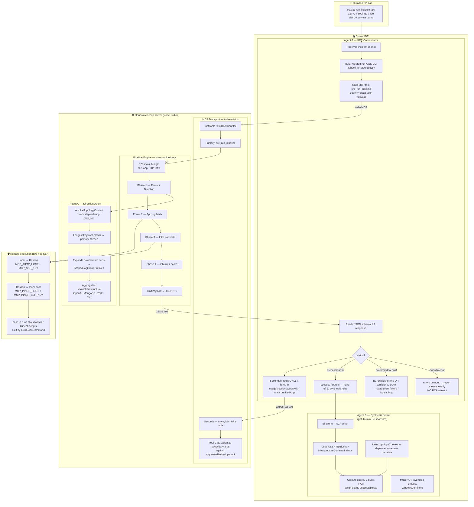
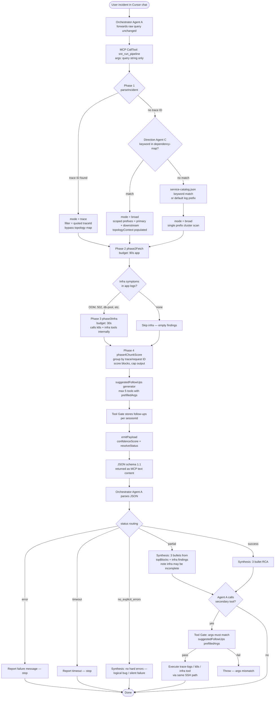
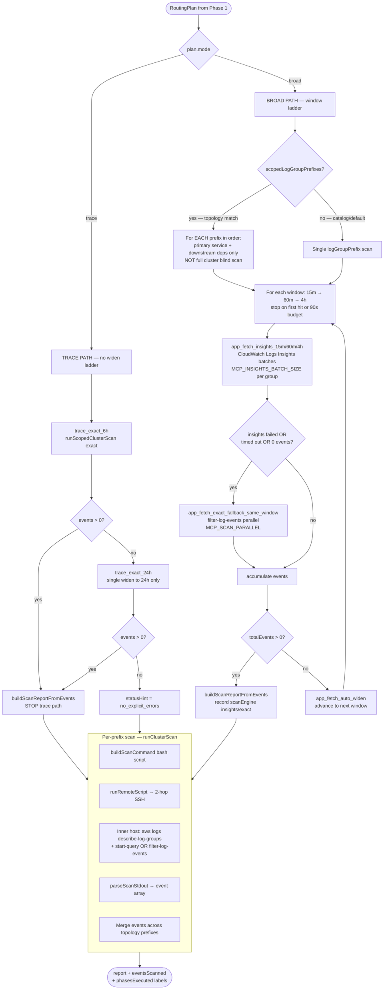
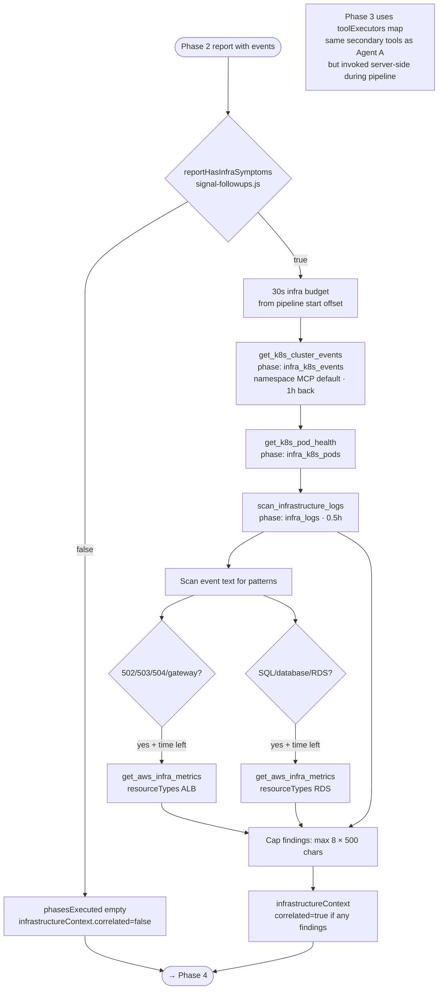
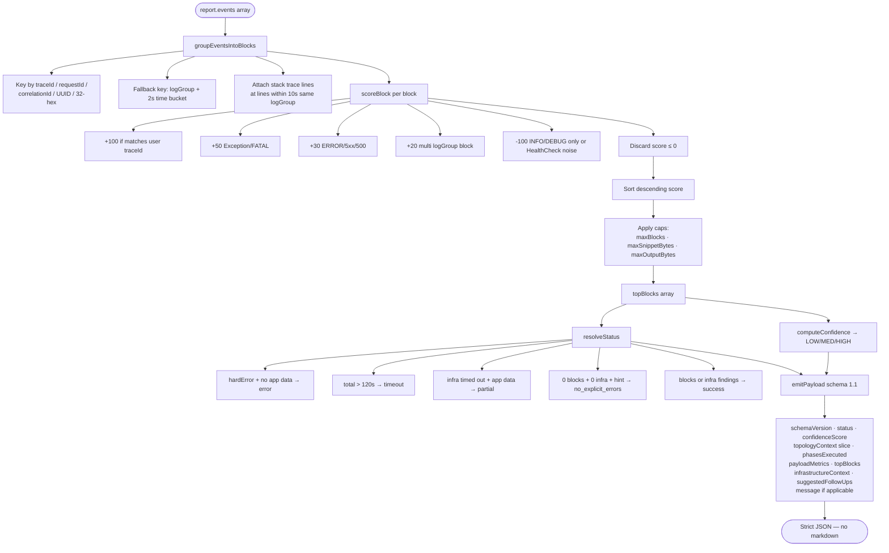
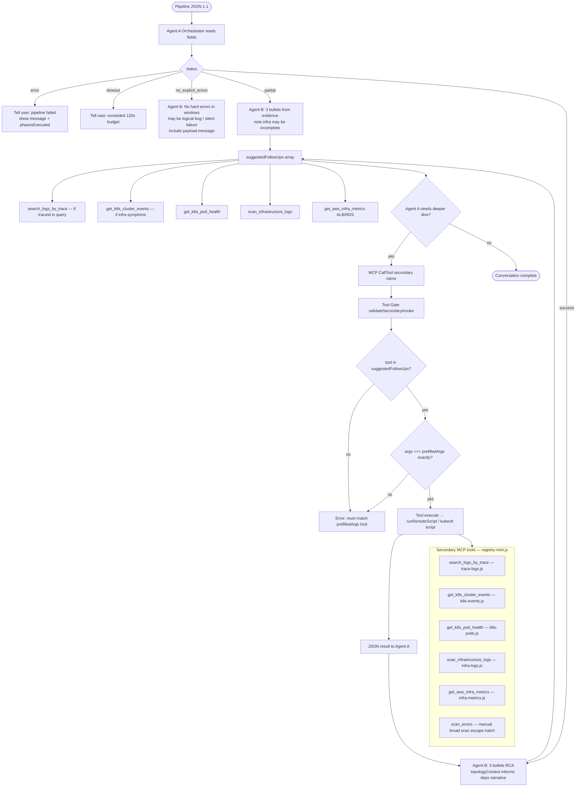
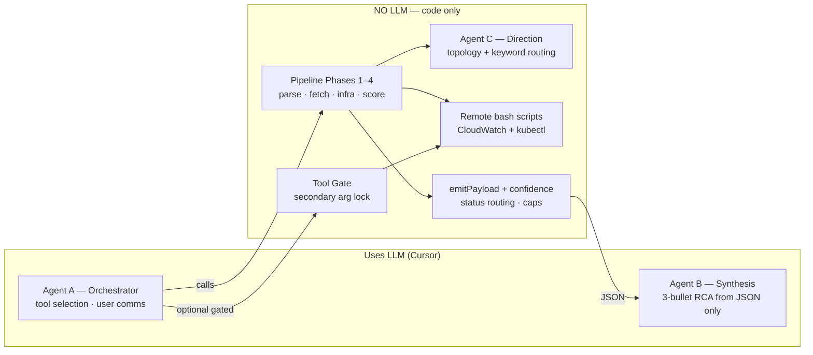
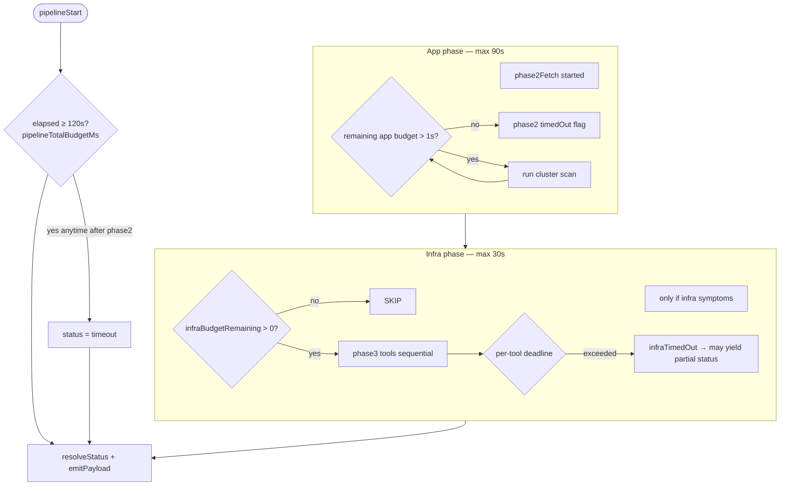

# CloudWatch MCP — Complete Flow (Diagrams Only)

---

## 1. System actors & responsibilities



---

## 2. End-to-end request lifecycle



---

## 3. Phase 1 — Parse incident & Direction Agent (detailed)

```mermaid
flowchart TD
  IN([query string from Agent A]) --> P1A[parseIncident — phase1_parse_incident]

  P1A --> T{extractTraceId<br/>UUID or 32-hex?}

  T -->|YES| TR[TRACE ROUTING PLAN]
  TR --> TR1[mode = trace]
  TR --> TR2[filterPattern = traceId in quotes]
  TR --> TR3[hoursBack = 6 initial]
  TR --> TR4[scanMode forced exact]
  TR --> TR5[topologyContext = null<br/>dependency map BYPASSED]
  TR --> TR6[logGroupPrefix from catalog<br/>if service keyword present<br/>else default prefix]

  T -->|NO| DIR[Direction Agent C — phase1_topology_resolve]
  DIR --> DIR1[Load dependency-map.json groups/services]
  DIR --> DIR2[Longest keyword match in user text]
  DIR --> DIR3{Match found?}

  DIR3 -->|YES| TC[topologyContext object]
  TC --> TC1[primaryTarget service name]
  TC --> TC2[logGroupPrefix for primary]
  TC --> TC3[knownDownstreamDependencies names]
  TC --> TC4[scopedLogGroupPrefixes:<br/>primary prefix + each downstream prefix]
  TC --> TC5[knownInfrastructure merged<br/>from primary + downstream infra deps]

  DIR3 -->|NO| CAT[matchServiceCatalog]
  CAT --> CAT1[Longest keyword in service-catalog.json]
  CAT --> CAT2[Else defaultPrefix from catalog/env]

  TC --> BROAD
  CAT --> BROAD[BROAD ROUTING PLAN]
  BROAD --> B1[mode = broad]
  BROAD --> B2[filterPattern = ERROR Exception fail<br/>REJECT CRITICAL 5xx]
  BROAD --> B3[hoursBack = parseWidenHoursHint<br/>or default 0.25h = 15m]
  BROAD --> B4[scanMode from MCP_SCAN_MODE<br/>insights | exact | auto]

  TR --> OUT([RoutingPlan → Phase 2])
  BROAD --> OUT
```

---

## 4. Phase 2 — App log fetch (trace vs broad vs topology)



---

## 5. Remote execution layer (SSH + AWS)

```mermaid
flowchart LR
  subgraph Local["MCP Node process"]
    L1[buildScanCommand<br/>insights OR exact bash]
    L2[spawn ssh BatchMode]
  end

  subgraph Hop1["Hop 1 — Bastion"]
    H1[ubuntu@MCP_JUMP_HOST<br/>-i MCP_SSH_KEY]
  end

  subgraph Hop2["Hop 2 — Inner"]
    H2[ssh -i MCP_INNER_SSH_KEY<br/>ubuntu@MCP_INNER_HOST bash -s]
    H3[Script stdin piped]
    H4[describe-log-groups by PREFIX]
    H5{mode}
    H6[Insights: start-query per group<br/>sleep 2 · get-query-results · jq TSV]
    H7[Exact: filter-log-events<br/>xargs parallel MCP_SCAN_PARALLEL]
    H8[stdout TSV: timestamp, logGroup, message]
    H9[__SCAN_META__ trailer line]
  end

  subgraph Limits["Timeouts & caps"]
    X1[MCP_EXEC_TIMEOUT_MS per call]
    X2[MCP_MAX_BUFFER stdout/stderr bytes]
    X3[Pipeline kills scan if app budget exceeded]
  end

  L1 --> L2 --> H1 --> H2 --> H3 --> H4 --> H5
  H5 -->|insights| H6 --> H8
  H5 -->|exact| H7 --> H8
  H8 --> H9
  H9 -->|stdout back to MCP| L2
  X1 -.-> H2
  X2 -.-> H8
```

---

## 6. Phase 3 — Infrastructure correlate (conditional)



---

## 7. Phase 4 — Chunk, score, emit & confidence



---

## 8. Post-pipeline — Orchestrator, Synthesis & gated secondary tools



---

## 9. Agent vs deterministic component map



---

## 10. Time & status budgets (control flow)


