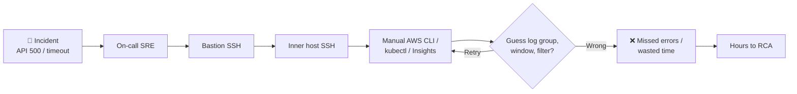
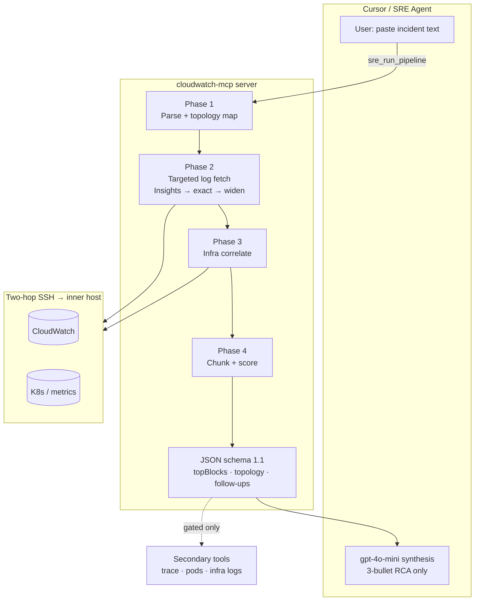
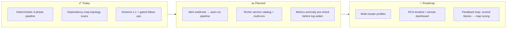

# Problem

**Incident RCA is slow, manual, and error-prone**

---

# Solution

**CloudWatch MCP — one tool, server-owned pipeline, strict JSON out**

---

# Future Plans

**From reactive log hunt → proactive, broader coverage**

